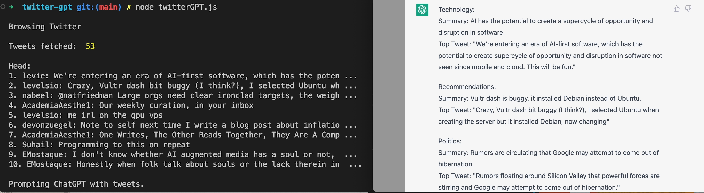

# twitterGPT

Fetches Twitter timeline and generates summary with [ChatGPT](https://openai.com/blog/chatgpt/). 



#### Setup 

This project uses [puppeteer](https://pptr.dev/) for browser automation.

```bash
npm install
# or `npm i puppeteer`
```

When launching puppeteer:
- Modify `userDataDir` to your own folder. This is where login creds are stored. 
- Modify `executablePath` to point to Chrome. 

#### Usage

```bash
node twitterGPT.js
```

#### Resources 
- [WebGPT](https://arxiv.org/abs/2112.09332)

#### License

MIT
